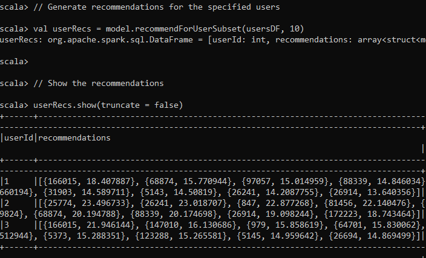
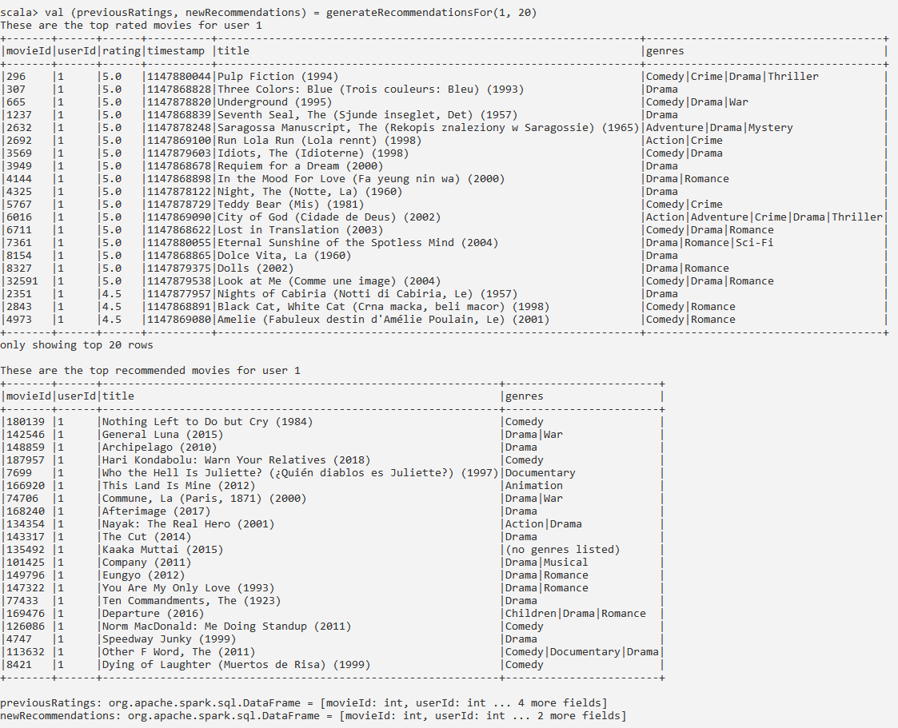

# Building a Movie Recommendation System Using Collaborative Filtering

Sam Chandler  _Big Data Analytics Section 01_  _Kennesaw State University_  Kennesaw, Georgia  <chandler.c.sam@gmail.com>

**_Abstract_— Recommending a movie that a user will actually like can be difficult, but this process can be improved through the use of algorithms trained on large datasets. This paper illustrates a collaborative filtering approach to creating a movie recommendation system that has been trained on the MovieLens 25M Dataset. The model has been fully implemented and evaluated. This paper examines the Alternating Least Squares (ALS) approach to collaborative filtering that was taken and why Singular Value Decomposition (SVD) ended up being a poor fit for the project.**

I. Research Statement and Conjecture

Machine Learning holds promise for enhancing various aspects of daily life, such as deciding what movie to watch. Deciding on a movie to watch can be an arduous process for individuals, but this thought process can be eliminated through the use of algorithms trained on large film databases to intelligently recommend a user’s next movie. This project sought out to achieve intelligent recommendations by employing a collaborative filtering technique onto the massive number of reviews from the MovieLens Dataset that is freely available. After thorough research on MovieLens, collaborative filtering versus content-based filtering, ALS, and SVD, a working build of the proposed system has been built.

The MovieLens Dataset was selected due to its breadth of available data and ease of use. This database has several different versions available for use, ranging greatly in size and release date. The official GroupLens website lists several available versions with relevant information for each \[1\]. The oldest legacy database contains only one hundred thousand reviews while the newest boasts thirty-three million reviews. The specific version that was selected for this project was the MovieLens 25M Dataset. It is the database “recommended for new research” according to the website and contains 25 million reviews on 62,000 movies by 162,000 users. In addition to being the recommended choice for research projects, this specific dataset is a good fit due to its reasonable size of 250 MB (compressed) and its fairly recent release date of 2019. The 250 MB size seemed like it was going to be an issue, since I needed a dataset in the gigabytes. However, as it turns out, the stated file size on the MovieLens website is just the size of the compressed zip folder. When unzipped, the full dataset is 1.07 GB large. Now, with a dataset over a Gigabyte, I had everything ready to begin building the recommender system.

The machine learning algorithms that were planned to be used on the dataset were Singular Value Decomposition (SVD) and Alternating Least Squares (ALS). Both of these methods can be used in collaborative filtering recommendation systems, which are able to predict user preferences based on the preferences of similar users or items. The success of using these approaches will be discussed in the coming sections.

II. Related Work

Before delving into the papers that specifically focus on MovieLens, it is important to discuss one of the most influential moments in collaborative filtering history. In 2006, Netflix launched a contest called the Netflix Prize, which promised $1M USD to the first team that could create a recommendation system better than Netflix’s current one \[2\]. In 2009, the grand prize was awarded to the “BellKor’s Pragmatic Chaos” solution, which used SVD (the model is officially dubbed timeSVD++) \[3\]. Needless to say, my interest in matrix factorization models was heightened greatly after hearing that at one point Netflix paid out a $1M grand prize just for a better one. Halliman and Striphas’s article \[2\] is great for a read, as the story surrounding this grand prize has a lot of controversy and interesting turns. But the reason for including this article is simply that an efficient algorithm is highly sought after, and their relevancy has only grown since 2009.

Fortunately for my project, there was a breadth of literature that had been written on similar projects performed with the MovieLens dataset. Álvaro González et al. discuss a similar project in their paper \[4\] that examines bias and unfairness towards minority groups in movie recommendation systems. Although their paper is primarily focused on societal issues regarding minorities and underrepresented groups, it is still beneficial to read their approach in working with the MovieLens Dataset. González et al. discuss the decision of which dataset from MovieLens to use (recall that there are several versions varying in size and content). I had already decided to use the 25M dataset and saw that they had chosen the 1M version instead. This was because the 1M dataset is the largest MovieLens dataset that also includes demographic information about its users. Obviously for a paper on bias towards minority groups, knowing the age, race, and location of reviewers is of interest. However, for my use of the dataset, this information is not as useful. Although the 25M dataset is lacking in specific user demographics, it makes up for this with a greater quantity of reviews and movies.

M. Sadeghian and M. Khansari examine various approaches to achieving a working system in their paper \[5\] about a MovieLens recommendation system built using similarity networks. They discuss the drawbacks associated with the different systems and propose a hybrid system that utilizes network science and machine learning. This was a bit reassuring, given that I too chose a hybrid system of ALS and SVD. The paper contained some valid criticism of SVD and ended up proving useful in my later realization about SVD that is discussed in the results.

Another useful read was the paper “The Comparison Study of Matrix Factorization on Collaborative Filtering Recommender System”, which examines ALS and SVD among other variations \[6\]. The paper proposes that the sparsity problem, a fault with SVD that was mentioned briefly by M. Sadeghian and M. Khansari in the aforementioned text, can be overcome with the MovieLens Dataset. Sparsity is an issue with recommendation systems that occurs when there is not enough data to properly identify similar users. However, as the authors of this text propose, the scale of the MovieLens Dataset may be so large as to offset SVD’s major flaw, making the algorithm perfect for this project. In the end SVD proved to not be perfect for this project, for other reasons than the major flaw that the authors had discussed.

This survey of relevant literature highlights some important topics when it comes to implementing the proposed system. The choice of dataset and algorithms impact the final product and one another. Careful consideration must be made with how these algorithms are implemented and how their strengths are taken advantage of. All of the previously mentioned sources provide some great intel into how to properly approach implementing a movie recommendation system, and many of them discuss the economic and ethical impacts of such algorithms.

III. Methodology

The following section explains the different methods of generating recommendations and which methods have been chosen for this project, along with what environment and programming language this project was coded in. Explanations for these choices are given as it relates to the MoiveLens dataset and the scope of the project.

_A. Collaborative Filtering_

There are a couple of different ways for achieving a working recommendation system. In one method, the characteristics of an item that the user likes are analyzed, and the user is then recommended other items that have similar attributes. This approach is called content-based filtering. Another approach is to look at other users that have similar tastes and recommend to the user an item that the similar users also like. This is called collaborative filtering. Thus, content-based filtering requires a lot of data on item features and collaborative filtering requires a lot of data on users.

Content-based filtering is a popular method for showing ads to users. If someone searches for a used car on the internet, they will be recommended other used cars that have similar features (make, price, color). In order for this system to be accurate, there must be a lot of features on the items themselves. That means the database would need a lot of columns. Collaborative filtering, however, is strengthened by the number of users and their interactions with the products, which can be in the form of ratings, clicks, purchases, and such. That means a lot of rows are needed for users, but item features are unnecessary. The item features can be extrapolated from the collaborative filtering model.

The biggest issue with collaborative filtering is that if the dataset is too small, it will be difficult to build good recommendations. This is exactly why collaborative filtering is the perfect method for the MovieLens 25M dataset. With 25 million reviews, the dataset is certainly not too small. And since the only features for the movies are the titles, genres, and a String of stars, this makes the dataset a poor fit for content-based filtering.

Collaborative filtering properly takes advantage of the MovieLens dataset’s incredible depth of reviews and lack of item features. That is why it was the chosen method for building the system.

_B. Alternating Least Squares_

Alternating Least Squares (ALS) is just one specific algorithmic implementation of collaborative filtering. As explained in the Apache documentation, ALS is based in matrix factorization, and it works by decomposing a user-item matrix (ratings.csv in this case) into two matrices: a user matrix _U_ with the users’ latent preferences and an item matrix _V_ with the items’ latent features.

ALS is particularly effective for collaborative filtering tasks because it optimizes the factorized matrices iteratively, alternating between fixing one matrix and optimizing the other. This alternating optimization process continues until convergence, effectively minimizing the difference between the actual ratings and the predicted ratings computed from the factorized matrices. By decomposing the original user-item matrix into latent factors, ALS can effectively capture the underlying patterns and relationships in the data, even in the presence of missing values or sparse data. This makes ALS a powerful tool for generating personalized recommendations based on user preferences and item characteristics.

This project made use of the ALS class in the Spark MLlib library (org.apache.spark.ml.recommendation.ALS). This library allowed me to immediately begin designing the implementation of the model on the MovieLens 25M dataset without having to worry about designing the gritty and complex matrix factorization myself.

_C. Singular Value Decomposition_

Singular Value Decomposition (SVD) is a technique in linear algebra for matrix factorization. It works by decomposing a matrix down into three matrices: an orthogonal matrix _U_ representing the left singular vectors, a diagonal matrix Σ containing the singular values along its diagonal, and a transpose of an orthogonal matrix representing the right singular vectors _VT_.

SVD sparked interest as a recommendation technique as part of the winning component in the Netflix Prize \[2\], a contest that was previously discussed in Section II. Ever since, SVD has shown promise as a useful means of discovering latent features in a dataset that may represent hidden correlations between users and items.

SVD was planned to be implemented in the final product, as part of a hybrid system with ALS. However, the effort of accomplishing this was soon found to be too great for its benefit, and SVD was ultimately dropped due to reasons that are discussed in Section IV.

_D. Spark and Scala_

Apache Spark is a user-friendly distributed computing framework with a variety of uses in different fields. For the scope of this project, Spark was chosen due to its ability in efficiently handling large datasets. Due to Spark being a popular and long-lasting fixture in the data analysis scene, there is a great deal of available resources (libraries, methods, literature, tutorials) that can assist in developing a project for the first time.

Scala is an object-oriented and functional language that is statically typed. It may not be as widely used as a language like Python, but it still offers a good number of useful tools and libraries for developing recommendation systems.

While Spark was an instructor-given requirement for this project, I opted to use Scala purely out of interest in learning how to better code in Spark with Scala. PySpark might have been an easier choice, especially given the number of similar projects that have been performed in PySpark. However, I ultimately decided that since this was first and foremost a research project, I had more to gain and learn if I opted to use Scala, which would force me to do my own problem solving for learning the language and developing a recommender system.

IV. Experimental Design, Results, Analyses, and Comparison

The development of my collaborative filtering approach to a recommender system underwent a pretty arduous process. This section examines the experimental design for implementing ALS, the results of ALS, the analysis of the output, and finally a comparison to related project.

_A. Experimental Design_

The design of my program involved using the ALS class from the Spark MLlib library. Since ALS is built using a user-item matrix, all I need is the ratings.csv file. This means that the other files in the database (tags.csv, movies.csv, etc.) go mostly unused in the program. In a content-based filtering algorithm, one would be able to make great use of these additional features, but ALS has no need for them since its job is to recommend based on unseen features.

First, the ratings are read in from the csv and converted to a DataFrame with the .toDF function. The ratings must then be made non-null to ensure no errors will be encountered later. Then, the data is split into an Array. 80% of the data is reserved for training and the remaining 20% is used for testing. Due to the massive size of the array, I was not too worried about the specific distribution of the training and testing, since either way they would both be in the millions.

I then construct the ALS model and fit the model using the training. Initially the model was fit to only a subset of the dataset since my laptop was unable to perform the fitting of the entire dataset, but I found a solution, as is discussed right after this in the results.

The cold start strategy ‘drop’ is used on the model to ensure that the model does not produce NaN evaluation metrics. The RegressionEvaluator is used with the RMSE metric to evaluate the performance of the predictions on the test data.

In addition to obtaining the RMSE for the test data, I implemented a couple of different ways for getting recommendations for users. You can simply use model.recommendForUserSubset(usersDF, numRecs), where usersDF is a subset of userIDs and numRecs is the number of desired recommendations to be generated. I implemented a lengthy method for generating more visually appealing output of recommendations while also displaying the user’s top rated movies for cross referencing. This utilizes the movies.csv file and joins the two DataFrames together to form a complete matrix that displays all necessary information about a recommendation.

I attempted several times to get a working build of the SVD algorithm, however, transforming and pivoting the ratings DataFrame so that it could be used for SVD turned out to be an incredibly complicated task 25 million reviews. Spark does not even recommend building a row matrix with over 10,000 columns (there are 62,000 movies). I tried building it myself, using a combination of libraries, but the dataset was too large to handle. I also realized quite quickly that SVD would not be as useful with the good performance of the single ALS model.

_B. Results_

Initially, the first testing of my ALS implementation was used on an ALS model that was trained on a small subset of the original ratings.csv DataFrame. This is because my Spark session would continuously crash while trying to fit and evaluate the model for the entire dataset. The subset was a mere 5% of the original dataset (which is still a staggering 1.25 million reviews, a number that outperforms the numerous related works on the 100K and 1M MovieLens datasets).

The 5% subset model still functioned and was able to produce some predictions. These predictions, however, were not that great. I decided to evaluate the model by measuring the root-mean-square error of the predictions.

> scala> val rmse = evaluator.evaluate(predictions)

> scala> println(s”Root-mean square error = $rmse”)

> Root-mean square error = 1.7075312169478483

An RMSE of 1.7 is not terrible for a recommender system. This means that each recommendation in the testing was about 1.7 stars off from the actual rating. An RMSE under 2 is generally expected of a working 5-star recommender, but an RMSE under 1 is strongly preferred.

Since the entire dataset was too large to run in Spark on my laptop, I planned on using the Kennesaw State University HPC to take advantage of the distributed computing capabilities of Spark. But I was eventually able to get it running on my PC, which has much more RAM and a stronger CPU. On my family’s higher performance PC, with more RAM allocated to Spark, I was able to fit and evaluate the model on the entire dataset.

> scala> println(s”Root-mean square error = $rmse”)

> Root-mean square error = 0.8169508029011205

An RMSE of 0.82 was much closer to what I was hoping for from model. This is an improvement of over 52%. I still, however, was not done experimenting to lower this RMSE.

After a couple failed experiments with implicitPrefs and regularization parameters, I got some improvement from raising the maximum number of iterations run by ALS. Going from 5 iterations to 10 iterations, I got some improved metrics.

> // 10 iterations

> scala> println(s”Root-mean square error = $rmse”)

> Root-mean square error = 0.8021127565192014

I then experimented with 20 iterations and even up to 40, however I began experiencing some fatal errors. 40 iterations was far too high, and even 20 iterations would occasionally crash. At 16 iterations I was able to get results just as good as those from 20 iterations with the added bonus of never experiencing a crash.

> // 16 iterations

> scala> println(s”Root-mean square error = $rmse”)

> Root-mean square error = 0.7984349228300510

These improvements are certainly not as drastic as those gained from switching from the subset to the full set, but they are nonetheless improvements. A 10% improvement for Netflix’s algorithm was good enough for $1M after all \[2\].

Since you cannot trust a single model’s RMSE (it is randomly split), I collected the scores from 5 subsequent runs and averaged them together to ensure I had not gotten lucky or cherry-picked a particularly good model.

> 0.7984349228300510

> 0.7987186157458663

> 0.7988052970555738

> 0.7984297655532712

> 0.7987672574363693

> Average: 0.79863117172423

Obviously, the output of this algorithm is more than just an RMSE score. Showing the head of the user recommendations is not the most appealing sight in its default view. The below figure depicts this.

**Figure 1. User Recommendations Output**

This output is gained by recommending items for a subset of 3 users (users 1, 2, and 3). The output displays the user’s ID along with a list of recommendations for the user. The output is not formatted in a visually appealing way, and it also does not display the actual titles of the movies. This is because, at this point, only the ratings.csv file is read in. The file structure of this csv includes columns for userId, rating, movieId, and timestamp. The movies.csv file must be joined to display the movie titles and genres without having to manually cross-reference the dataset.

**Figure 2. Output from Running generateRecommendations() on User 1**

After a lot of time was spent learning how to properly join and display DataFrames in Spark with Scala, the final build of the app was built that included a method for making recommendations. The method returns the user’s top-rated movies and the user’s top recommended movies, along with printing out the top several rows for each.

Figure 2 shows the output for the method generateRecommendations() on userId=1 and numRecs=20. Visually, it is easy to spot some similarities between the user’s favorite movies and the recommendations. Comedies and dramas make up the majority of user 1’s top movies, and they also make most of the recommendations. It is important to remember that the genres of the movies are not at all touched or considered in the collaborative filtering algorithm. This shows that the latent hidden feature of genre has indeed been utilized when generating recommendations.

_C. Analyses_

The average RMSE score of 0.79863117172423 suggests the collaborative filtering ALS recommender is working quite well. The recommendations for users also appear to mostly make sense when compared to the user’s tastes. Overall, the results display ALS’s capability of extracting latent features from a simple user-item matrix.

These promising results suggest that further effort should be made in optimizing and expanding upon the current system, rather than creating an entirely new system. Although the thought of adding SVD was attractive at first, the good performance of the ALS by itself suggests that SVD would have little to offer. My thoughts on how to expand the project from here would be to either perform on a larger dataset (such as the MovieLens 33M dataset), perform in a distributed computing environment like the Kennesaw State University HPC to allow for more iterations than just 16, or perform greater preprocessing on the data before the ALS algorithm.

_D. Comparison_

Compared to other projects in this similar field, I am quite pleased with the results. During my research I read a collaborative filtering approach performed by someone on Github and their RMSE was 1447.6814769930884 \[7\]. Keep in mind that this was also performed on the MovieLens dataset (albeit 1M) in the same 5-star rating system. Their explanation for this absurdly high RMSE was that they had overfitted the data. So when I received my initial score of 1.7, I was actually very relieved that I did not suffer from a similar error.

M. Sadeghian and M. Khansari, which had performed several different algorithms \[5\], had some interesting metrics. Their implementation of SVD had an RMSE of 2.37, which is much worse than my initial subset ALS RMSE. Their content-based method, however, had an RMSE of 0.99, which is fairly respectable. I am glad that the SVD metric was not anything special, as I would have been sad to see it perform well after I had resolved to abandon it. Fortunately, as I suspected, the impressive matrix-factorization algorithm SVD is simply not as useful as collaborative filtering on a large and explicit feedback-based dataset like the MovieLens 25M dataset. Interestingly, they also included metrics for the execution times of each algorithm. I now wish that I had kept metrics for that as well, because I can assure that my ALS algorithm took a couple minutes to run.

V. Conclusion

Collaborative filtering with ALS remains a promising way for generating recommendations for millions of users with nothing more than the interactions of other users. In-depth item descriptions and complex categorizations are not needed when the massive user base can be leveraged for matrix factorization. The model developed in this paper demonstrates how, if the dataset is large enough, a complex recommendation system can be built with nothing more than a couple of columns.

I am pleased with the output generated by the ALS algorithm and slightly disappointed in my lack of advancement into SVD. However, I have realized that the possible advantages of SVD or a hybrid system are wasted on this dataset. When I initially wrote the Project Proposal, I had in mind that ALS or SVD would be too weak on their own. However, I have realized that a robust ALS implementation, with appropriate parameter tuning, can yield satisfactory results for the specific dataset at hand. Additionally, the scalability and ease of implementation of ALS in distributed computing frameworks like Apache Spark make it a practical choice for large-scale datasets like the MovieLens 25M dataset. While SVD definitely has its merits in certain contexts, such as dimensionality reduction and interpretability, it may not offer significant advantages over ALS for recommendation tasks with explicit feedback data. The MovieLens 25M dataset includes explicit feedback in the form of 5-star ratings, which makes a straightforward implementation of ALS more appealing than if the dataset worked with other forms of feedback such as clicks. Therefore, focusing on optimizing the ALS model and exploring alternative techniques for enhancing its performance seems like the correct path to take from here.

In the future, I would like to dive deeper into this project and develop an even more accurate model. While the 25M dataset was certainly large enough to get a working system, I would like to see how improvement could be made with something like the 33M dataset. Additionally, if I could run the code on an HPC (or simply a more powerful computer than my own), then I could run the model with more iterations and results from experimentations with the model would be quicker to perform.

VI. References

\[1\] “Movielens Dataset,” GroupLens, <https://grouplens.org/datasets/movielens>

\[2\] B. Hallinan and T. Striphas, “Recommended for you: : The Netflix Prize and the production of algorithmic culture,” Sage Publications, 2016, Vol. 18(1) 117-137, <https://journals.sagepub.com/doi/pdf/10.1177/1461444814538646>.

\[3\] Y. Koren, The BellKor Solution to the Netflix Grand Prize. 2009.

\[4\] Á. González, F. Ortega, D. Pérez-López and S. Alonso, "Bias and Unfairness of Collaborative Filtering Based Recommender Systems in MovieLens Dataset," in _IEEE Access_, vol. 10, pp. 68429-68439, 2022, doi: 10.1109/ACCESS.2022.3186719.

\[5\] M. Sadeghian and M. Khansari, "A Recommender Systems Based on Similarity Networks: MovieLens Case Study," _2018 9th International Symposium on Telecommunications (IST)_, Tehran, Iran, 2018, pp. 705-709, doi: 10.1109/ISTEL.2018.8661141.

\[6\] A. Priyati, A. D. Laksito and H. Sismoro, "The Comparison Study of Matrix Factorization on Collaborative Filtering Recommender System," _2022 5th International Conference on Information and Communications Technology (ICOIACT)_, Yogyakarta, Indonesia, 2022, pp. 177-182, doi: 10.1109/ICOIACT55506.2022.9972018.

\[7\] J. Le, “Movie Recommendation with Content-Based and Collaborative Filtering”, <https://github.com/khanhnamle1994/movielens/blob/master/Content_Based_and_Collaborative_Filtering_Models.ipynb>
